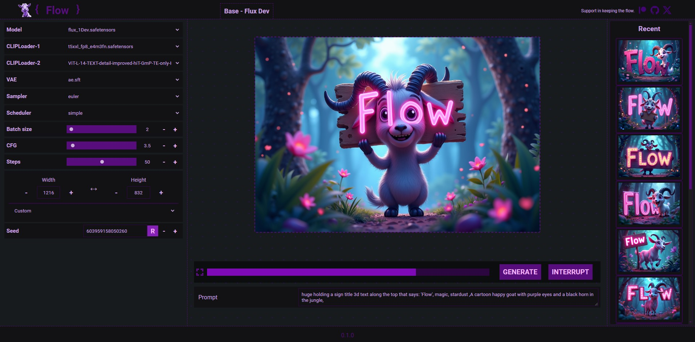
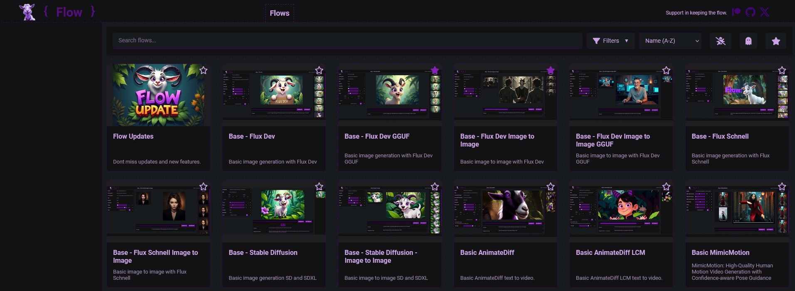
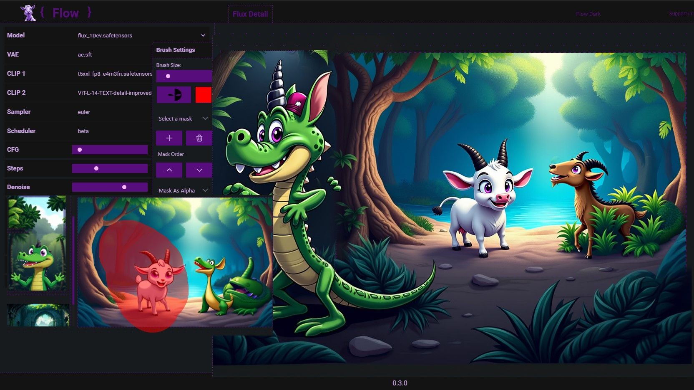
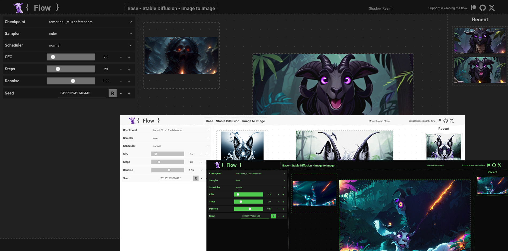
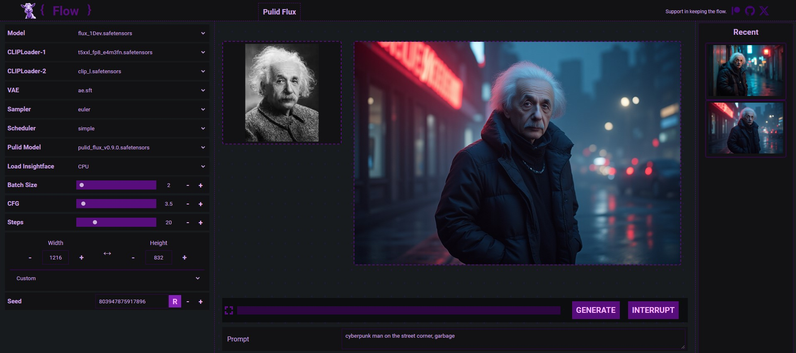
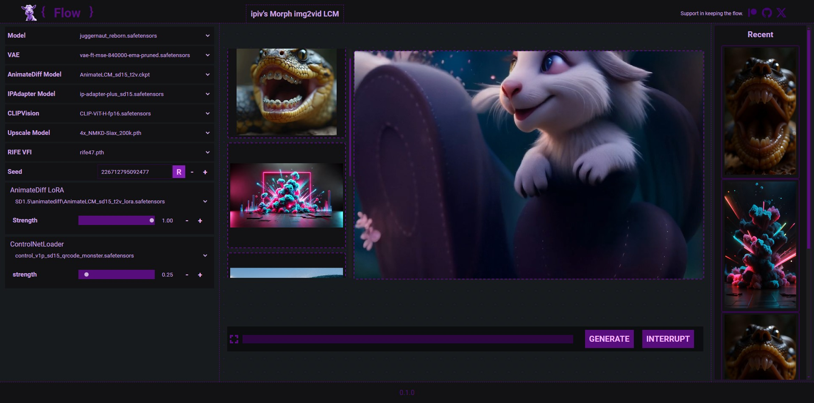

<!-- Improved compatibility of back to top link: See: https://github.com/othneildrew/Best-README-Template/pull/73 -->
<a name="readme-top"></a>
<!--
*** Thanks for checking out the Best-README-Template. If you have a suggestion
*** that would make this better, please fork the repo and create a pull request
*** or simply open an issue with the tag "enhancement".
*** Don't forget to give the project a star!
*** Thanks again! Now go create something AMAZING! :D
-->
<!--
*** I'm using markdown "reference style" links for readability.
*** Reference links are enclosed in brackets [ ] instead of parentheses ( ).
*** See the bottom of this document for the declaration of the reference variables
*** for contributors-url, forks-url, etc. This is an optional, concise syntax you may use.
*** https://www.markdownguide.org/basic-syntax/#reference-style-links
-->
<br />
<div align="center">

[](https://www.patreon.com/distyx)

<!--  -->

  <h1 align="center">Flow - Streamlined Way to ComfyUI</h1>


  <h4 align="center"><em>Let your creativity flow naturally</em></h4>
  <h4 align="center">Don't forget to leave a star.</h4>
  
  
  <p align="center">
    <a href="https://github.com/diStyApps/ComfyUI-disty-Flow/issues">Report Bug</a>
  </p>
</div>


<!-- TABLE OF CONTENTS -->
<details>
  <summary>Table of Contents</summary>
  <ol>
    <li>
      <a href="#about-the-project">About The Project</a>
    </li>
    <li><a href="#installation">Installation</a></li>
    <li><a href="#roadmap">Roadmap</a></li>
    <li><a href="#contact">Contact</a></li>
    <li><a href="#my-other-projects">My Other Projects</a></li>    

    
  </ol>
</details>

<!-- ABOUT THE PROJECT -->
## About The Project

Flow is a custom node designed to provide user-friendly interface for ComfyUI by acting as an alternative user interface for running workflows. It is not a replacement for workflow creation.

Flow is currently in the early stages of development, so expect bugs and ongoing feature enhancements. With your support and feedback, Flow will settle into a steady stream.













<p align="right">(<a href="#readme-top">back to top</a>)</p>

#### Requirements
 - [ComfyUI](https://github.com/comfyanonymous/ComfyUI)
 - [ComfyUI-Manager](https://github.com/ltdrdata/ComfyUI-Manager)
 
<!-- INSTALLATION -->
## Installation


In [ComfyUI](https://github.com/comfyanonymous/ComfyUI) root folder, navigate to the `custom_nodes` folder and run the following command:

Open the terminal, or in the address bar type CMD to open a command prompt, then run the following command:

```bash
git clone https://github.com/diStyApps/ComfyUI-disty-Flow
```

To run Flow, navigate to this address in your web browser:

```bash
http://127.0.0.1:8188/flow
```

<p align="right">(<a href="#readme-top">back to top</a>)</p>

<!-- ROADMAP -->
## Roadmap

### Flow Customization
- [x] Flow Linker
- - [ ] Improved Flow Linker
- Expanded Flow Components
- Enhanced Customization Options

### Feature Support
- [x] Canvas / Masking / Inpainting Functionality
- - [x] Improved Canvas / Masking / Inpainting Functionality
- - [ ] Outpainting Functionality
- - Improving Inpainting Functionality

- [ ] Enhanced Media Handling
- [x] Live Preview
- [ ] Prompt Tracking

### UI/UX Enhancements
- [ ] Status Bar Implementation
- [ ] Optimized Menu for Flow Organization
- General User Interface Improvements

### Media and Model Management
- [ ] Media Gallery Integration
- [ ] Model Gallery Integration

### Pre-built Flows
- Exclusive Flows for various tasks
  - Task-specific Flows
  - Continuous updates to support evolving needs

### Codebase Improvements
- [ ] Code Optimization and Refactoring
- [ ] Better Error Handling
- [ ] Improved Event Handling

<p align="right">(<a href="#readme-top">back to top</a>)</p>

<!-- CONTACT -->
## Contact

distty@gmail.com


<p align="right">(<a href="#readme-top">back to top</a>)</p>

<!-- MY OTHER PROJECTS -->
## My Other Projects

[SEAIT](https://github.com/diStyApps/seait)

[ComfyUI_FrameMaker](https://github.com/diStyApps/ComfyUI_FrameMaker)

[VisionCrafter](https://github.com/diStyApps/VisionCrafter)

[FaceSwapSuite](https://github.com/diStyApps/FaceSwapSuite)

[VisualClipPicker](https://github.com/diStyApps/VisualClipPicker)

[Stable-Diffusion-Pickle-Scanner-GUI](https://github.com/diStyApps/Stable-Diffusion-Pickle-Scanner-GUI)

[Safe-and-Stable-Ckpt2Safetensors-Conversion-Tool-GUI](https://github.com/diStyApps/Safe-and-Stable-Ckpt2Safetensors-Conversion-Tool-GUI)


<p align="right">(<a href="#readme-top">back to top</a>)</p>


